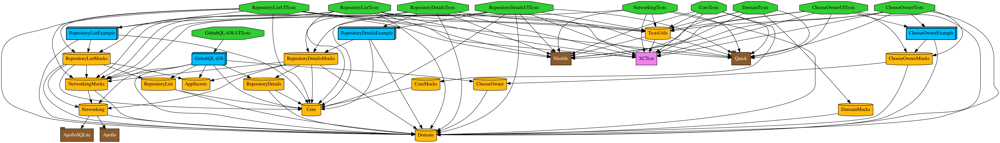
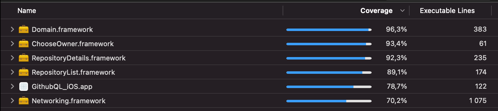

# GithubQL-iOS 
[](https://app.bitrise.io/app/8b5c5e93f5463ab5)

## General
App that allows to choose repository owner, see it's repositories, and see each repository details with opened/closed issues and opened/closed pull requests.

Project use [Apollo iOS](https://github.com/apollographql/apollo-ios) library to communicate with the GitHub GraphQL API.

## Preview


## Architecture
Project implements adopted [µFeatures Architecture](https://docs.tuist.io/building-at-scale/microfeatures), for better Clean Architecture approach. 
Adopting µFeatures allows great scalability and modularization. 

There are 2 types of `Module`:
- Feature - can be considered as features (screens) of the app, here you can find UI related code
- Foundation - modules that provide shared functionalities

Each module have its own `Mocks` and `Tests` targets.

All feature modules are independent and thanks to that, you can see that all of them have it's own `Example` target, that is simply example app for the feature 🎉

### Modules 
- Features layer
    - `ChooseOwner` - screen for choosing Github owner
    - `RepositoryList` - screen for displaying owner's repositories
    - `RepositoryDetails` - screen for displaying repository details
- Foundation layer
    - `Domain` - business logic, independent, describes interfaces and use cases
    - `Networking` - networking layer build on `Apollo`, dependent on `Domain`
    - `Core` - core iOS shared implementations, like `ListErrorCell`, used in multiple modules
    - `TestsUtils` - unit tests utilities
    - `AppSecrets` - app secrets

Full dependency graph: 


## Building project
**IMPORTANT**: Project works with Xcode 12.5. Lower versions are not supported because of statically linked SPM packages.

First of all, I'm encouraging to install [Tuist](https://docs.tuist.io/tutorial/get-started), but if you don't want to it's fine, since it's bundled into repository 😉.

Projects is using a few tools, like SwiftLint, SwiftFormat and Sourcery. You don't have to worry about installing those, because it's going to be done automatically.

To build the project, follow this steps:

1. Open terminal and `cd` to the project root folder
1. Run `.tuist-bin/tuist up`
1. Run `.tuist-bin/tuist generate --open`
1. Xcode project should open automatically

> **Note:** If you have `tuist` installed locally, you can simply run `tuist` instead of `.tuist-bin/tuist`

## Adding new module
1. To simplify this process, you can use tuist templates for modules. To create new feature, run in project root `tuist scaffold feature-framework --name {feature_name}`, or to create foundation  `tuist scaffold foundation-framework --name {feature_name}`. 
1. If you need to configure created module, run `tuist edit`.

Example:
1. `tuist scaffold feature-framework --name UserProfile`
1. `tuist edit`
1. Go to `Tuist/ProjectDescriptionHelpers/` folder and edit `Feature.swift` and add new feature case (`Foundation.swift` for foundation framework)
1. Edit `Github-GraphQL-Browser/Feature/UserProfile/Project.swift`
    - set `type: Feature.userProfile,`
    - set targets (`uFeatureTarget`), you can use `uFeatureTarget.feature` to set all supported targets (or `.foundation` for foundation framework)
    ```swift
    targets: uFeatureTarget.feature
    ```
    - add internal dependencies, e.x.
    ```swift
    internalDependencies: [
        Foundation.domain,
    ]
    ```
    - add external dependencies if needed
    - add resources globs, e.x.
    ```swift
    resources: [
        .glob(pattern: "**/*.xib"),
        .glob(pattern: "Resources/**"),
    ]
    ```
1. > **NOTE:** See `Tuist/ProjectDescriptionHelpers/Project+Templates.swift` for more configuration options
1. `tuist up`
1. `tuist generate --open`

## Authorization
The app needs valid Github access token in order to authorize with Github API. Access token needs to be provided by setting value of `API_TOKEN` in `Github-GraphQL-Browser/Foundation/AppSecrets/SupportingFiles/Configuration/Debug.xcconfig` 

## Linting
Project uses SwiftLint and SwiftFormat to follow unified code style.

## CI
CI is configured with Bitrise thats run all unit tests, UI test for main App target, but skips UI tests for features (I have 10 min limit for builds 😅). 

At first I tried Github Actions, but unfortunately it still don't support MacOS Big Sure with Xcode 12.5, that is required to build the project.

## Tests 
So at the beginning I wanted to keep things simple and use plain `XCTest` bundle for unit testing, although daily I'm more Quick+Nimble fan 🙂. 

Later it turned out that in fact Quick+Nimble with it's BDD flavor and nice verbose descriptions would indeed be better decision, but I didn't wanted to rewrite everything 😅 . There is one class rewrited to `QuickSpec` to just present the ability of using this bundle, see `RepositoryDetailsFetchUseCaseSpec.swift`.



### Running tests
Tuist in it's glory automatically creates aggregate target to that links all workspace targets. Simply change target to `Github-GraphQL-Browser-Project` and hit `cmd+u`.

### Flaky tests
I decided to try new approach when it comes to testing callbacks, generally I wanted to avoid nesting and poor readability. That gave birth to `Watcher.swift` that can be found in `TestsUtils` module. 

Basically it works. Locally everything plays nicely. Although, there are 2 tests that for unknown reason came up flaky when run on CI. After giving it few hours I couldn't figure out the reason (maybe simulator cold start?), so I'm skipping them on CI.

## Misc
Memory leak free 😇
